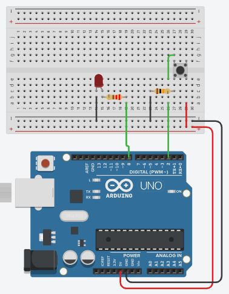

# Arduino Button LED Toggle

## Overview
This project demonstrates how to use a **push button** with an **Arduino Uno** to control an **LED** in toggle mode.



The behavior is simple:
- Press the button once → the LED turns **ON**
- Press the button again → the LED turns **OFF**

This project is useful for learning:
- Digital input reading
- Digital output control
- Button state detection
- Toggle logic
- Basic debouncing

---

## Components
- Arduino Uno
- Breadboard
- Push Button
- LED
- 2 Resistors
- Jumper Wires
- USB Cable

---

## Wiring

### LED Connections
- LED **anode (+)** → Resistor → Digital Pin **8**
- LED **cathode (-)** → **GND**

### Button Connections
- One side of the push button → **5V**
- Other side of the push button → Digital Pin **2**
- A resistor is connected from the button line to **GND** as a **pull-down resistor**

### Power Connections
- Arduino **5V** → Breadboard **+ rail**
- Arduino **GND** → Breadboard **- rail**

---

## How It Works
The Arduino continuously reads the state of the push button.

When the button is pressed:
- The code detects the press
- The LED state is flipped
- If it was OFF, it becomes ON
- If it was ON, it becomes OFF

A short delay is added to reduce unwanted multiple reads caused by button bounce.

---

## Code
```cpp
const int buttonPin = 2;   // Push button connected to pin 2
const int ledPin = 8;      // LED connected to pin 8

int buttonState = 0;
int lastButtonState = 0;
bool ledState = false;

void setup() {
  pinMode(buttonPin, INPUT);
  pinMode(ledPin, OUTPUT);
  digitalWrite(ledPin, LOW);
}

void loop() {
  buttonState = digitalRead(buttonPin);

  // Detect button press (rising edge)
  if (buttonState == HIGH && lastButtonState == LOW) {
    ledState = !ledState;              // Toggle LED state
    digitalWrite(ledPin, ledState);    // Apply new state
    delay(200);                        // Simple debounce
  }

  lastButtonState = buttonState;
}
